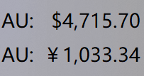

# GoldPrice - TrafficMonitor 金价插件

实时显示国际金价的 [TrafficMonitor](https://github.com/zhongyang219/TrafficMonitor) 插件。

## 功能

- **美元金价**: 显示 XAU/USD 美元/盎司实时价格
- **人民币金价**: 自动换算为人民币/克价格
- **实时汇率**: 每小时自动拉取美元/人民币实时汇率（来源: open.er-api.com）
- **刷新间隔**: 可设置 30/60/120/300 秒
- **鼠标悬停**: 显示美元/人民币双价及更新时间



## 下载

从 [Releases](https://github.com/zhongyang219/TrafficMonitorPlugins/releases) 下载编译好的 DLL，或自行编译。

## 安装

1. 根据你的 TrafficMonitor 架构选择对应版本:
   - 64位: `bin\x64\GoldPrice.dll`
   - 32位: `bin\Win32\GoldPrice.dll`
2. 将 DLL 复制到 TrafficMonitor 目录下的 `plugins\` 文件夹
3. 重启 TrafficMonitor
4. 右键任务栏 → 显示设置 → 勾选 "金价(美元/盎司)" 或 "金价(人民币/克)"

## 自行编译

**环境**: Visual Studio 2022 Build Tools (v145) + Windows SDK 10.0

```powershell
# x64
msbuild GoldPrice.sln /p:Platform=x64 /p:Configuration=Release

# x86 (Win32)
msbuild GoldPrice.sln /p:Platform=Win32 /p:Configuration=Release
```

输出路径: `bin\x64\GoldPrice.dll` / `bin\Win32\GoldPrice.dll`

## 数据源

| 数据 | API | 说明 |
|------|-----|------|
| 金价 | `api.gold-api.com/price/XAU` | 免费金价API |
| 汇率 | `open.er-api.com/v6/latest/USD` | 免费汇率API，无需Key |

## 选项设置

在 TrafficMonitor → 插件管理 → 实时金价 → 选项中可调整:
- 刷新间隔: 30/60/120/300 秒
- 美元/人民币汇率: 可手动覆盖（自动汇率每隔1小时拉取）
- 显示涨跌: 是否显示价格变动

## 文件结构

```
├── include/PluginInterface.h      # TrafficMonitor 插件接口
├── GoldPrice/
│   ├── GoldPrice.h/.cpp           # 插件主类 + DLL导出
│   ├── GoldPriceItem.h/.cpp       # 显示项（IPluginItem）
│   ├── DataManager.h/.cpp         # 数据管理（HTTP + 配置）
│   └── GoldPrice.rc               # 对话框资源
├── bin/
│   ├── Win32/GoldPrice.dll
│   └── x64/GoldPrice.dll
└── GoldPrice.sln
```

## 许可

MIT
